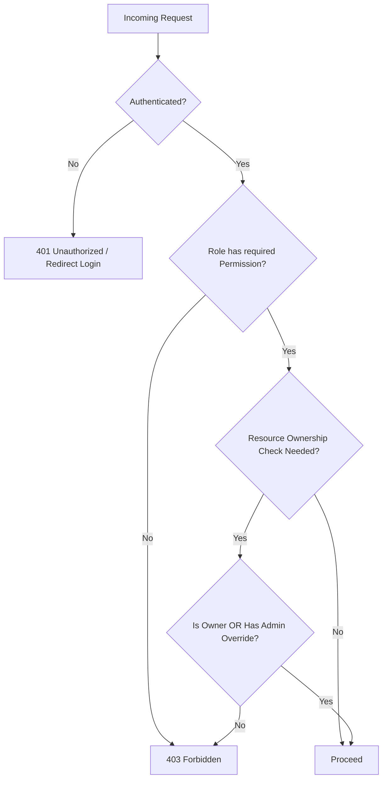

# ARCHITECTURE.md — System Architecture

---

## 1. High-Level System Map

```text
                              PAZARZ PLATFORM
                                     │
              ┌──────────────────────┴──────────────────────┐
              │                                              │
        CUSTOMER SURFACE                              LARAVEL BACKEND
        (React + Vite SPA)                                   │
              │                                ┌──────────────┴──────────────┐
              │  REST API (JSON, token auth)   │                             │
              └────────────────────────────────▶        API Layer            │
                                                 │   (/api/v1/*, stateless)   │
                                                 └──────────────┬──────────────┘
                                                                │
                                                  ┌─────────────┴─────────────┐
                                                  │      Application Core      │
                                                  │  (Services / Actions /     │
                                                  │   Policies / Events)       │
                                                  └─────────────┬─────────────┘
                                                                │
                              ┌─────────────────────────────────┼─────────────────────────────────┐
                              │                                 │                                 │
                    BLADE WEB (session auth)                MySQL DATABASE                  External Services
                              │                                                          (Payment GW, Courier API,
              ┌───────────────┴───────────────┐                                            Email/Notification)
              │                               │
     Seller Dashboard                 Admin Dashboard
     (Laravel Blade)                  (Laravel Blade)
```

Pazarz menggunakan **hybrid architecture**: React + Vite murni untuk Customer (dikonsumsi lewat REST API), dan Laravel Blade untuk Seller & Admin (server-rendered, langsung terhubung ke business logic). Laravel menjadi **single source of truth** — tidak ada logic yang diduplikasi antar surface. Pembagian ini bersifat final dan tidak boleh diubah tanpa instruksi eksplisit (lihat `AI-CODING-RULES.md`).

---

## 2. Backend Architecture (Laravel)

Laravel bertindak sebagai **single source of truth** untuk seluruh business logic, dikonsumsi oleh dua permukaan berbeda:
1. **API Layer** (`routes/api.php`) — dikonsumsi React (Customer).
2. **Web Layer** (`routes/web.php`) — dirender langsung sebagai Blade (Seller & Admin Dashboard).

**Prinsip kunci:** business logic (validasi, kalkulasi harga, perubahan status order, dsb.) ditempatkan di **layer Service/Action**, bukan di Controller — agar logic yang sama dapat dipakai ulang oleh API Controller maupun Blade Controller tanpa duplikasi.

```text
app/
├── Http/
│   ├── Controllers/
│   │   ├── Api/          → controller untuk React (return JSON)
│   │   └── Web/
│   │       ├── Seller/   → controller untuk Seller Dashboard (return Blade view)
│   │       └── Admin/    → controller untuk Admin Dashboard (return Blade view)
│   ├── Requests/         → Form Request validation (dipakai kedua layer)
│   └── Resources/        → API Resource (transformer response JSON)
├── Services/              → business logic reusable (mis. OrderService, CheckoutService)
├── Actions/               → single-purpose operations (mis. PlaceOrderAction)
├── Policies/               → resource ownership authorization (lihat §7)
├── Models/
├── Events/ & Listeners/    → mis. OrderPlaced → kirim notifikasi ke seller
└── Notifications/
```

## 3. Frontend Architecture (Customer — React + Vite)

- **SPA murni**, mengonsumsi Pazarz REST API (`/api/v1/*`) — lihat `API.md`.
- State management terpisah antara **server state** (data dari API — direkomendasikan pola query/cache seperti React Query) dan **client state** (UI state — cart drawer terbuka, filter aktif, dst).
- Struktur folder berbasis fitur (feature-based), bukan berbasis tipe file semata, agar scalable:

```text
src/
├── features/
│   ├── auth/
│   ├── catalog/
│   ├── cart/
│   ├── checkout/
│   ├── orders/
│   └── profile/
├── components/     → shared UI components (mengikuti DESIGN.md)
├── layouts/
├── lib/            → API client, utils
└── routes/
```

## 4. Blade Architecture (Seller & Admin)

- Kedua dashboard berbagi **layout dasar & komponen Blade** (sidebar, topbar, table, card) namun dengan **navigasi dan permission berbeda**.
- Direkomendasikan struktur:

```text
resources/views/
├── layouts/
│   ├── dashboard.blade.php     → shared shell (sidebar+topbar slot)
│   └── partials/
├── seller/
│   ├── dashboard.blade.php
│   ├── products/
│   ├── orders/
│   └── settings/
└── admin/
    ├── dashboard.blade.php
    ├── users/
    ├── sellers/
    ├── products/
    └── settings/
```

- Interaktivitas ringan (filter table, modal konfirmasi) dapat memakai pendekatan hybrid (mis. Alpine.js/Livewire) — keputusan tool spesifik didokumentasikan lebih lanjut pada fase development, bukan fase ini.

## 5. API Architecture

- API bersifat **stateless** (token-based), versioned (`/api/v1/`), mengikuti konvensi di `API.md`.
- API Resource class dipakai untuk membentuk response JSON yang konsisten dan menyembunyikan struktur internal database dari client.

## 6. Database Architecture

- MySQL sebagai single relational store untuk seluruh data transaksional (lihat `DATABASE.md`).
- Tidak ada database terpisah per role — seluruh permukaan (API & Blade) membaca/menulis ke database yang sama melalui Model/Service layer yang sama, menjamin konsistensi data real-time antar dashboard.

---

## 7. Authentication & Authorization Architecture

### 7.1 Ringkasan Permukaan Auth

| Surface | Teknologi | Metode Auth |
|---|---|---|
| Customer (React + Vite) | SPA, konsumsi REST API | Token-based (Bearer token / SPA session token) |
| Seller Dashboard (Laravel Blade) | Server-rendered | Session-based (cookie) |
| Admin Dashboard (Laravel Blade) | Server-rendered | Session-based (cookie) |

Kedua mekanisme (token untuk React, session untuk Blade) **berbagi tabel `users` dan logika otorisasi yang sama** di backend Laravel — hanya berbeda di layer transport kredensial.

### 7.2 Customer Authentication (React)

```text
Register  : name, email, password, password_confirmation
            → validasi format & uniqueness email
            → buat user (role: customer), password di-hash
            → kirim email verifikasi (signed token, expiring)
            → fitur yang butuh verifikasi terkunci hingga email diverifikasi

Verify    : klik link verifikasi → validasi signature & expiry
            → set users.email_verified_at → redirect ke React app (logged-in)

Login     : email, password → validasi kredensial
            → issue access token (+ refresh token bila arsitektur memakainya)
            → token disimpan di client (memory + httpOnly cookie untuk refresh
              token, direkomendasikan dibanding localStorage untuk mitigasi XSS)
            → setiap request API menyertakan token di header Authorization

Logout    : client memanggil endpoint logout → server invalidate/rotate token
            → client menghapus token lokal
```

- React menyimpan status auth (user object + permission list ringkas) di state global (context/store).
- Setiap load awal aplikasi, client memverifikasi token via endpoint `me` untuk hydrate state.
- Token invalid/expired → redirect ke halaman login, simpan intended URL untuk redirect balik setelah login.
- Password reset mengikuti flow yang sama di `USER-FLOW.md` §1.3, hanya berbeda UI (React vs Blade).

### 7.3 Seller & Admin Authentication (Laravel Blade)

- **Login:** form login server-rendered → POST credentials → Laravel session dibuat (cookie httpOnly + secure) → redirect ke dashboard sesuai role.
- **Session management:** session disimpan di server (database/redis session driver — ditentukan di fase development). CSRF protection wajib aktif untuk seluruh form. Session timeout Admin lebih ketat (mis. 30–60 menit idle) dibanding Seller (beberapa jam).
- **Seller-specific:** seller yang belum lolos verifikasi (`sellers.verification_status = pending`) tetap bisa login namun diarahkan ke halaman status "Menunggu Verifikasi", bukan dashboard penuh.
- **Admin-specific:** akun admin tidak melalui self-registration publik — dibuat melalui seeding/invitation oleh admin lain dengan permission `manage-users`. 2FA untuk admin dicatat sebagai future scope (lihat `FEATURES.md`).

### 7.4 Token/Session Security Notes

- Password di-hash dengan algoritma standar industri (bcrypt/argon2) — never plaintext, never reversible encryption.
- Rate limiting pada endpoint login/register/reset-password untuk mitigasi brute-force.
- Refresh token (jika dipakai) di-rotate setiap kali dipakai untuk mitigasi token replay.
- Seluruh transport auth wajib melalui HTTPS.
- Endpoint `me`/`logout` harus memvalidasi token/session pada setiap pemanggilan, tidak mengandalkan cache client semata.

### 7.5 Konsep Otorisasi (RBAC + Ownership)

Pazarz menggunakan model **Role-Based Access Control (RBAC)** dengan granular permission (bukan sekadar `if role === 'admin'`), agar di masa depan mudah menambah sub-role (mis. `admin_support`, `admin_finance`) tanpa mengubah struktur inti.

- **Role**: kelompok besar (`customer`, `seller`, `admin`).
- **Permission**: hak akses granular (`manage-products`, `view-reports`, dst), dipetakan ke role via `role_permissions`.
- **Resource Ownership**: sebagian aksi tidak cukup dicek lewat permission saja — perlu dicek apakah resource tersebut milik actor (mis. seller hanya boleh edit produk **miliknya sendiri**).
- **Admin Override**: admin dengan permission terkait dapat mengakses/mengubah resource **lintas kepemilikan** (mis. admin dapat menonaktifkan produk seller manapun).

**Authentication** = memverifikasi identitas ("siapa kamu") — §7.2–7.4. **Authorization** = memverifikasi hak akses ("apa yang boleh kamu lakukan") — diterapkan di layer API/Controller melalui **Policy** (per-resource ownership check) + **Middleware/Gate** (permission check).

Urutan pengecekan pada setiap request yang butuh otorisasi:
```text
1. Apakah request terautentikasi? (Authentication)
2. Apakah role/permission user mengizinkan aksi ini secara umum? (Permission)
3. Apakah user adalah owner dari resource spesifik ini, ATAU punya admin override? (Ownership)
```



### 7.6 Resource Ownership Rules

| Resource | Owner | Catatan |
|---|---|---|
| Product | Seller (via Store) | Seller hanya bisa CRUD produk milik store-nya sendiri |
| Order (customer view) | Customer (pemilik order) | Customer hanya bisa lihat order miliknya |
| Sub-Order (seller view) | Seller (via Store) | Seller hanya bisa proses sub-order yang store-nya terlibat |
| Store Settings | Seller pemilik store | 1 seller = 1 store |
| Review | Customer penulis (untuk edit/hapus) | Seller hanya boleh membalas (`seller_reply`), tidak edit isi review |
| Coupon (store-level) | Seller pemilik store | Coupon platform-wide hanya dibuat Admin |

Admin dengan permission relevan (`manage-products`, `manage-orders`, dst.) memiliki **override** terhadap seluruh rule di atas untuk keperluan moderasi/support.

### 7.7 Full Permission Matrix

Skala: **✓** = diizinkan, **Own** = hanya milik sendiri, **–** = tidak diizinkan.

| Capability | Customer | Seller | Admin |
|---|---:|---:|---:|
| Register & Login | ✓ | ✓ | – (dibuat oleh Super Admin) |
| Browse & search produk | ✓ | ✓ | ✓ |
| Kelola wishlist & cart | ✓ | – | – |
| Checkout & bayar | ✓ | – | – |
| Lihat order milik sendiri | Own | – | ✓ (semua) |
| Beri review produk yang dibeli | Own | – | – (moderasi saja) |
| Daftar sebagai seller | ✓ | – | – |
| Kelola profil toko | – | Own | ✓ (override) |
| Kelola produk & varian | – | Own | ✓ (override/moderasi) |
| Kelola stok/inventory | – | Own | – (lihat saja) |
| Proses sub-order (confirm/ship) | – | Own | – (lihat saja) |
| Balas review | – | Own | – |
| Buat promosi/kupon toko | – | Own | – |
| Lihat analitik toko sendiri | – | Own | ✓ (semua toko) |
| Kelola kategori & atribut global | – | – | ✓ |
| Verifikasi pendaftaran seller | – | – | ✓ |
| Suspend/aktifkan user atau seller | – | – | ✓ |
| Moderasi produk/review/report | – | – | ✓ |
| Kelola & mediasi dispute | Own (ajukan) | Own (respon) | ✓ (mediasi & putuskan) |
| Buat kupon platform-wide | – | – | ✓ |
| Lihat laporan & analitik platform | – | – | ✓ |
| Kelola pengaturan platform | – | – | ✓ |
| Lihat audit log | – | – | ✓ |

### 7.8 Permission List (Granular — untuk tabel `permissions`)

```text
Group: user
- view-users, manage-users, suspend-users

Group: seller
- view-sellers, verify-sellers, manage-sellers

Group: store
- manage-own-store, view-all-stores

Group: product
- manage-own-products, view-all-products, moderate-products

Group: category
- manage-categories

Group: order
- view-own-orders (customer), view-own-sub-orders (seller),
  process-own-sub-orders, view-all-orders (admin)

Group: payment
- view-own-payments, view-all-payments (admin)

Group: review
- create-review (customer), reply-review (seller), moderate-reviews (admin)

Group: promotion
- manage-own-promotions (seller), manage-platform-promotions (admin)

Group: dispute
- raise-dispute, respond-dispute, mediate-disputes

Group: report
- submit-report, review-reports

Group: analytics
- view-own-store-analytics, view-platform-analytics

Group: platform
- manage-platform-settings, view-audit-logs
```

### 7.9 Catatan Implementasi (untuk Fase Development)

- Setiap role default memiliki permission set tetap (seed data), namun struktur `role_permissions` memungkinkan kustomisasi tanpa migrasi ulang.
- Pengecekan **ownership** diimplementasikan sebagai Laravel Policy per model (`ProductPolicy`, `SubOrderPolicy`, dst.), dipanggil di Controller/Form Request — bukan hardcode di dalam Controller.
- Endpoint API (`API.md`) mendokumentasikan permission yang dibutuhkan per endpoint secara eksplisit.

---

## 8. Communication Between Systems

| Dari | Ke | Mekanisme |
|---|---|---|
| React (Customer) | Laravel | REST API (HTTPS, JSON) |
| Blade (Seller/Admin) | Laravel | Direct (server-rendered, same app) |
| Laravel | Payment Gateway | Outbound API call + webhook callback untuk update status pembayaran |
| Laravel | Courier/Shipping Provider | Outbound API call (cek ongkir, buat pengiriman) + webhook untuk update tracking |
| Laravel | Email/Notification Service | Queue-based job (async, tidak blocking request) |

## 9. Shared Business Logic

Contoh logic yang **wajib** ditempatkan di Service layer agar konsisten di seluruh entry point (API & Blade):
- Kalkulasi harga akhir order (subtotal, diskon, ongkir, grand total).
- Validasi & pengurangan stok saat checkout (mencegah race condition oversell — direkomendasikan pakai locking/transaction di level database saat fase development).
- Perubahan status order/sub-order beserta efek sampingnya (notifikasi, pencatatan histori).
- Perhitungan komisi platform terhadap seller saat sub-order `completed`.

## 10. Scalability & Maintainability Considerations

- Query-heavy endpoints (catalog listing, admin reports) dirancang untuk mendukung pagination & filtering dari awal (bukan tambahan belakangan).
- Event-driven side effects (notifikasi, audit log) memakai Laravel Events/Listeners agar Controller/Service tetap fokus pada logic inti (single responsibility).
- Struktur modular (Services/Actions per domain) memudahkan ekstraksi ke service terpisah di masa depan jika platform tumbuh besar (bukan kebutuhan MVP, namun arsitektur tidak menutup opsi ini).
