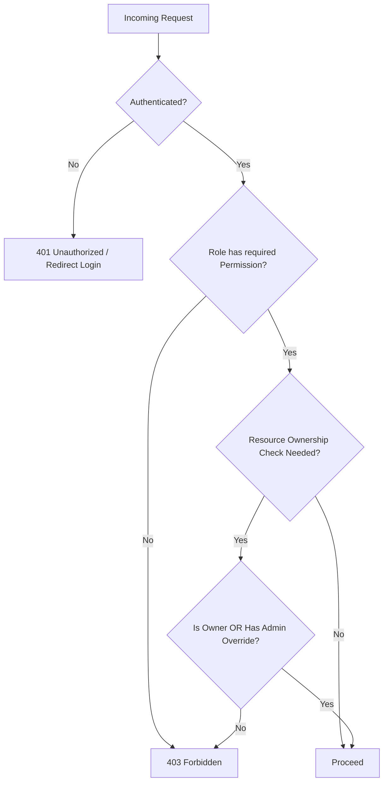

# AUTH.md — Authentication Architecture

> Dokumen ini adalah spesifikasi arsitektur, bukan implementasi kode.

---

## 1. Ringkasan Permukaan Auth

| Surface | Teknologi | Metode Auth |
|---|---|---|
| Customer (React + Vite) | SPA, konsumsi REST API | Token-based (Bearer token / SPA session token) |
| Seller Dashboard (Laravel Blade) | Server-rendered | Session-based (cookie) |
| Admin Dashboard (Laravel Blade) | Server-rendered | Session-based (cookie) |

Kedua mekanisme (token untuk React, session untuk Blade) **berbagi tabel `users` dan logika otorisasi yang sama** di backend Laravel — hanya berbeda di layer transport kredensial.

---

## 2. Customer Authentication (React)

### 2.1 Register
```text
Input: name, email, password, password_confirmation
→ Validasi format & uniqueness email
→ Buat user (role: customer), password di-hash
→ Kirim email verifikasi (link berisi signed token, expiring)
→ Response: user belum bisa akses fitur yang butuh verifikasi hingga email diverifikasi
```

### 2.2 Email Verification
```text
User klik link verifikasi
→ Validasi signature & expiry token
→ Set users.email_verified_at
→ Redirect ke React app (logged-in state)
```

### 2.3 Login
```text
Input: email, password
→ Validasi kredensial
→ Jika valid: issue access token (dan refresh token jika arsitektur memakainya)
→ Token disimpan di client (memory + httpOnly cookie untuk refresh token, direkomendasikan
  dibanding localStorage untuk mitigasi XSS)
→ Setiap request API selanjutnya menyertakan token di header Authorization
```

### 2.4 Logout
```text
Client memanggil endpoint logout
→ Server invalidate/rotate token terkait
→ Client menghapus token lokal
```

### 2.5 Password Reset
Lihat `FLOW.md` § Authentication Flow — flow sama berlaku, hanya berbeda di halaman UI (React vs Blade).

### 2.6 Authentication State (Client)
- React menyimpan status auth (user object + permission list ringkas) di state global (mis. context/store).
- Setiap load awal aplikasi, client memverifikasi token dengan memanggil endpoint `me` untuk hydrate state.
- Token invalid/expired → redirect ke halaman login, simpan intended URL untuk redirect balik setelah login.

---

## 3. Seller & Admin Authentication (Laravel Blade)

### 3.1 Login
```text
Form login (server-rendered)
→ POST credentials
→ Laravel session dibuat (cookie httpOnly + secure)
→ Redirect ke dashboard sesuai role (Seller Dashboard / Admin Dashboard)
```

### 3.2 Session Management
- Session disimpan di server (database/redis session driver — ditentukan di `ARCHITECTURE.md`).
- CSRF protection wajib aktif untuk seluruh form (standar Laravel Blade).
- Session timeout dikonfigurasi berbeda untuk Admin (lebih ketat, mis. 30–60 menit idle) dibanding Seller (lebih longgar, mis. beberapa jam).

### 3.3 Seller-specific
- Seller yang belum lolos verifikasi (`sellers.verification_status = pending`) tetap bisa login namun diarahkan ke halaman status "Menunggu Verifikasi", bukan dashboard penuh.

### 3.4 Admin-specific
- Akun admin tidak melalui self-registration publik — dibuat melalui seeding/invitation oleh admin lain dengan permission `manage-users`.
- Direkomendasikan menambahkan lapisan tambahan untuk admin di masa depan (mis. 2FA) — dicatat sebagai future scope, bukan MVP.

---

## 4. Authorization Flow (Berlaku untuk Semua Surface)



Detail role-check & permission-check lengkap ada di `ROLES.md`.

---

## 5. Token/Session Security Notes (Arsitektur, bukan kode)

- Password di-hash dengan algoritma standar industri (mis. bcrypt/argon2) — never plaintext, never reversible encryption.
- Rate limiting pada endpoint login/register/reset-password untuk mitigasi brute-force.
- Refresh token (jika dipakai) di-rotate setiap kali dipakai (rotation strategy) untuk mitigasi token replay.
- Seluruh transport auth wajib melalui HTTPS.
- Endpoint `me`/`logout` harus memvalidasi token/session pada setiap pemanggilan, tidak mengandalkan cache client semata.
