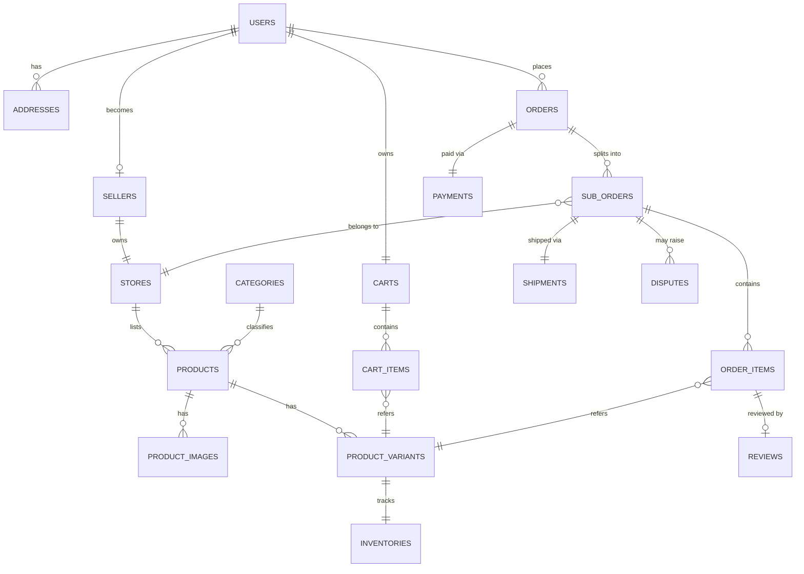

# ERD.md — Entity Relationship Design

Dokumen ini mendefinisikan seluruh entity database Pazarz beserta relasi, cardinality, dan constraint utama. Dokumen ini menjadi acuan langsung untuk pembuatan Laravel migration pada fase development.

---

## 1. Entity List (Final)

```text
users
roles
permissions
role_permissions (pivot)
sellers
stores
addresses
categories
products
product_images
product_variants
product_attributes
product_attribute_values
inventories
carts
cart_items
wishlists
wishlist_items
orders
sub_orders
order_items
payments
shipments
shipment_tracking_events
reviews
review_images
promotions
promotion_products
coupons
coupon_usages
notifications
seller_followers
reports
disputes
dispute_messages
audit_logs
```

> Catatan: `role_permissions`, `shipment_tracking_events`, `coupon_usages`, dan `dispute_messages` ditambahkan di luar contoh awal karena diperlukan secara business logic (lihat penjelasan masing-masing).

---

## 2. Entity Detail

### 2.1 `users`
- **Purpose:** Menyimpan seluruh akun (customer, seller, admin) dalam satu tabel — role membedakan kapabilitas.
- **Key fields:** `id` (PK), `name`, `email` (unique), `password`, `phone`, `role_id` (FK), `email_verified_at`, `status` (active/suspended), `avatar_url`, `deleted_at`, timestamps.
- **Relationships:** 1—1 dengan `sellers` (opsional, jika user adalah seller); 1—N dengan `addresses`, `orders`, `carts`, `wishlists`, `reviews`, `notifications`.
- **Constraints:** `email` unique; `role_id` not null.
- **Indexes:** `email`, `role_id`, `status`.

### 2.2 `roles`
- **Purpose:** Master role (customer, seller, admin, dan sub-role admin jika diperlukan misalnya `admin_support`).
- **Key fields:** `id`, `name` (unique), `slug`, `description`.
- **Relationships:** 1—N ke `users`; M—N ke `permissions` via `role_permissions`.

### 2.3 `permissions`
- **Purpose:** Daftar granular permission (`manage-products`, `manage-users`, dst) — lihat `ROLES.md`.
- **Key fields:** `id`, `name` (unique), `slug`, `group` (mis. "product", "order", "user").
- **Relationships:** M—N ke `roles`.

### 2.4 `role_permissions`
- **Purpose:** Pivot table role↔permission.
- **Key fields:** `role_id` (FK), `permission_id` (FK).
- **Constraints:** Composite unique (`role_id`,`permission_id`).

### 2.5 `sellers`
- **Purpose:** Data profil penjual (extension dari `users` ketika role = seller), termasuk status verifikasi.
- **Key fields:** `id`, `user_id` (FK, unique), `business_name`, `business_type`, `tax_id`, `verification_status` (pending/verified/rejected), `verified_at`, `commission_rate`.
- **Relationships:** 1—1 dengan `users`; 1—1 dengan `stores`.
- **Indexes:** `user_id` (unique), `verification_status`.

### 2.6 `stores`
- **Purpose:** Etalase publik seller (nama toko, deskripsi, banner, rating agregat).
- **Key fields:** `id`, `seller_id` (FK, unique), `name`, `slug` (unique), `logo_url`, `banner_url`, `description`, `rating_avg`, `rating_count`, `status` (active/inactive), `address_id` (FK).
- **Relationships:** 1—N ke `products`; 1—N ke `seller_followers`.
- **Indexes:** `slug` (unique), `status`.

### 2.7 `addresses`
- **Purpose:** Alamat milik user (pengiriman) maupun store (asal pengiriman).
- **Key fields:** `id`, `addressable_id`, `addressable_type` (polymorphic: `User`/`Store`), `label`, `recipient_name`, `phone`, `province`, `city`, `district`, `postal_code`, `full_address`, `latitude`, `longitude`, `is_default`.
- **Relationships:** Polymorphic ke `users` dan `stores`.
- **Indexes:** (`addressable_id`,`addressable_type`).

### 2.8 `categories`
- **Purpose:** Kategori produk hierarkis (self-referencing untuk sub-kategori).
- **Key fields:** `id`, `parent_id` (FK nullable, self-reference), `name`, `slug` (unique), `icon_url`, `is_active`, `sort_order`.
- **Relationships:** 1—N ke `products`; self 1—N (parent-child).
- **Indexes:** `slug`, `parent_id`.

### 2.9 `products`
- **Purpose:** Produk inti milik sebuah store.
- **Key fields:** `id`, `store_id` (FK), `category_id` (FK), `name`, `slug`, `description`, `base_price`, `status` (draft/active/inactive/archived), `weight_grams`, `rating_avg`, `rating_count`, `sold_count`, `deleted_at`.
- **Relationships:** 1—N ke `product_variants`, `product_images`, `reviews`, `order_items` (via variant); M—N ke `promotions` via `promotion_products`.
- **Constraints:** `slug` unique per store.
- **Indexes:** `store_id`, `category_id`, `status`, full-text pada `name`.

### 2.10 `product_images`
- **Purpose:** Galeri gambar produk (banyak per produk).
- **Key fields:** `id`, `product_id` (FK), `url`, `sort_order`, `is_primary`.
- **Relationships:** N—1 ke `products`.

### 2.11 `product_variants`
- **Purpose:** Kombinasi atribut (mis. Merah/L) sebagai unit jual dengan SKU & harga sendiri.
- **Key fields:** `id`, `product_id` (FK), `sku` (unique), `price` (override, nullable = pakai `base_price`), `image_id` (FK nullable ke `product_images`).
- **Relationships:** 1—1 ke `inventories`; N—1 ke `products`; N—N ke `product_attribute_values` via tabel pivot implisit (lihat 2.13).
- **Indexes:** `sku` (unique), `product_id`.

### 2.12 `product_attributes`
- **Purpose:** Definisi jenis atribut (mis. "Warna", "Ukuran") — global/reusable per kategori.
- **Key fields:** `id`, `name`, `category_id` (FK nullable jika global).

### 2.13 `product_attribute_values`
- **Purpose:** Nilai konkret suatu atribut (mis. "Merah") sekaligus menjadi pivot ke variant.
- **Key fields:** `id`, `product_attribute_id` (FK), `product_variant_id` (FK), `value`.
- **Constraints:** Composite unique (`product_variant_id`,`product_attribute_id`).

### 2.14 `inventories`
- **Purpose:** Stok per variant, terpisah dari data produk agar update stok tidak mengunci tabel produk.
- **Key fields:** `id`, `product_variant_id` (FK, unique), `quantity`, `reserved_quantity`, `low_stock_threshold`.
- **Relationships:** 1—1 ke `product_variants`.
- **Indexes:** `product_variant_id` (unique).

### 2.15 `carts` & 2.16 `cart_items`
- **Purpose:** Keranjang aktif user (1 cart per user) dan isinya per variant.
- **Key fields (`carts`):** `id`, `user_id` (FK, unique).
- **Key fields (`cart_items`):** `id`, `cart_id` (FK), `product_variant_id` (FK), `quantity`, `price_snapshot`.
- **Constraints:** Composite unique (`cart_id`,`product_variant_id`).

### 2.17 `wishlists` & 2.18 `wishlist_items`
- **Purpose:** Daftar simpan produk favorit user.
- **Key fields (`wishlists`):** `id`, `user_id` (FK, unique).
- **Key fields (`wishlist_items`):** `id`, `wishlist_id` (FK), `product_id` (FK).
- **Constraints:** Composite unique (`wishlist_id`,`product_id`).

### 2.19 `orders`
- **Purpose:** Order induk milik satu transaksi checkout customer (bisa mencakup banyak seller).
- **Key fields:** `id`, `order_number` (unique), `user_id` (FK), `shipping_address_id` (FK), `subtotal`, `shipping_total`, `discount_total`, `grand_total`, `status` (pending_payment/paid/processing/completed/cancelled), `placed_at`.
- **Relationships:** 1—N ke `sub_orders`; 1—1 ke `payments` (umumnya 1 payment per order).
- **Indexes:** `order_number` (unique), `user_id`, `status`.

### 2.20 `sub_orders`
- **Purpose:** Pecahan order per seller — unit kerja utama bagi seller (proses, kirim, selesai per sub-order).
- **Key fields:** `id`, `order_id` (FK), `store_id` (FK), `subtotal`, `shipping_cost`, `status` (pending/confirmed/processing/shipped/completed/cancelled), `cancelled_reason`.
- **Relationships:** 1—N ke `order_items`; 1—1 ke `shipments`.
- **Indexes:** `order_id`, `store_id`, `status`.

### 2.21 `order_items`
- **Purpose:** Baris item dalam sebuah sub-order, snapshot harga saat transaksi.
- **Key fields:** `id`, `sub_order_id` (FK), `product_variant_id` (FK), `product_name_snapshot`, `variant_label_snapshot`, `price_snapshot`, `quantity`, `subtotal`.
- **Relationships:** N—1 ke `sub_orders`; N—1 ke `product_variants`.

### 2.22 `payments`
- **Purpose:** Catatan transaksi pembayaran terhadap `orders` (via payment gateway eksternal).
- **Key fields:** `id`, `order_id` (FK, unique), `method` (va/e-wallet/card), `provider`, `provider_reference`, `amount`, `status` (pending/success/failed/refunded), `paid_at`.
- **Indexes:** `order_id` (unique), `status`, `provider_reference`.

### 2.23 `shipments`
- **Purpose:** Data pengiriman per sub-order.
- **Key fields:** `id`, `sub_order_id` (FK, unique), `courier`, `tracking_number`, `status` (pending/picked_up/in_transit/delivered/failed), `shipped_at`, `delivered_at`.
- **Relationships:** 1—N ke `shipment_tracking_events`.

### 2.24 `shipment_tracking_events`
- **Purpose:** Riwayat status pengiriman granular (untuk timeline tracking di UI).
- **Key fields:** `id`, `shipment_id` (FK), `status`, `description`, `location`, `occurred_at`.

### 2.25 `reviews`
- **Purpose:** Ulasan customer terhadap produk yang telah dibeli (terikat ke `order_item` untuk validasi eligibilitas).
- **Key fields:** `id`, `order_item_id` (FK, unique), `user_id` (FK), `product_id` (FK), `rating` (1–5), `comment`, `seller_reply`, `status` (visible/hidden/flagged).
- **Constraints:** Satu review per `order_item_id`.

### 2.26 `review_images`
- **Purpose:** Lampiran foto pada review.
- **Key fields:** `id`, `review_id` (FK), `url`.

### 2.27 `promotions`
- **Purpose:** Kampanye diskon milik seller (mis. diskon persentase pada produk tertentu, periode tertentu).
- **Key fields:** `id`, `store_id` (FK), `name`, `type` (percentage/fixed), `value`, `starts_at`, `ends_at`, `status`.
- **Relationships:** M—N ke `products` via `promotion_products`.

### 2.28 `promotion_products`
- **Purpose:** Pivot promosi↔produk.
- **Key fields:** `promotion_id` (FK), `product_id` (FK).
- **Constraints:** Composite unique.

### 2.29 `coupons`
- **Purpose:** Kode kupon (platform-wide atau per-store) dengan aturan penggunaan.
- **Key fields:** `id`, `store_id` (FK nullable = platform-wide), `code` (unique), `type`, `value`, `min_spend`, `usage_limit`, `starts_at`, `ends_at`, `status`.

### 2.30 `coupon_usages`
- **Purpose:** Mencatat siapa memakai kupon apa di order mana — mencegah reuse melebihi limit.
- **Key fields:** `id`, `coupon_id` (FK), `user_id` (FK), `order_id` (FK), `used_at`.
- **Constraints:** Composite unique (`coupon_id`,`order_id`).

### 2.31 `notifications`
- **Purpose:** Notifikasi in-app untuk seluruh role (polymorphic recipient).
- **Key fields:** `id`, `notifiable_id`, `notifiable_type` (polymorphic: `User`), `type`, `title`, `body`, `data` (JSON), `read_at`.
- **Indexes:** (`notifiable_id`,`notifiable_type`), `read_at`.

### 2.32 `seller_followers`
- **Purpose:** Customer mengikuti toko favorit.
- **Key fields:** `id`, `user_id` (FK), `store_id` (FK).
- **Constraints:** Composite unique (`user_id`,`store_id`).

### 2.33 `reports`
- **Purpose:** Laporan yang diajukan user terhadap produk/toko/review (bahan moderasi admin).
- **Key fields:** `id`, `reporter_id` (FK ke `users`), `reportable_id`, `reportable_type` (polymorphic: `Product`/`Store`/`Review`), `reason`, `description`, `status` (open/reviewed/dismissed/actioned).

### 2.34 `disputes`
- **Purpose:** Sengketa transaksi (mis. barang tidak sesuai) antara customer & seller, dimediasi admin.
- **Key fields:** `id`, `sub_order_id` (FK), `raised_by` (FK ke `users`), `reason`, `status` (open/in_review/resolved/rejected), `resolution`, `resolved_by` (FK ke `users`, admin), `resolved_at`.
- **Relationships:** 1—N ke `dispute_messages`.

### 2.35 `dispute_messages`
- **Purpose:** Thread komunikasi dalam satu dispute (customer, seller, admin).
- **Key fields:** `id`, `dispute_id` (FK), `sender_id` (FK), `message`, `attachment_url`.

### 2.36 `audit_logs`
- **Purpose:** Jejak audit aksi sensitif admin (mis. suspend user, ubah komisi, hapus produk).
- **Key fields:** `id`, `actor_id` (FK ke `users`), `action`, `subject_id`, `subject_type`, `changes` (JSON), `ip_address`, `created_at`.
- **Indexes:** `actor_id`, `subject_type`+`subject_id`.

---

## 3. Mermaid ERD (Ringkas — Core Commerce Flow)



---

## 4. Catatan Desain Skema

- **Split order→sub_order** dipilih agar setiap seller punya unit kerja independen (status, shipment, dispute) tanpa saling mengunci data order induk.
- **Snapshot fields** (`price_snapshot`, `product_name_snapshot`, dst) sengaja didenormalisasi di `order_items` agar riwayat transaksi tidak berubah walau produk/harga di master data berubah kemudian.
- **Polymorphic tables** (`addresses`, `notifications`, `reports`) dipakai untuk entity yang secara natural dipakai lintas beberapa model, menghindari duplikasi tabel serupa.
- Semua tabel transaksional inti memakai `id` bertipe **UUID atau BIGINT auto-increment** (ditentukan lebih lanjut di `DATABASE.md`), dengan `created_at`/`updated_at` standar, dan `deleted_at` (soft delete) pada entity yang berdampak ke histori (`users`, `products`, `stores`).
