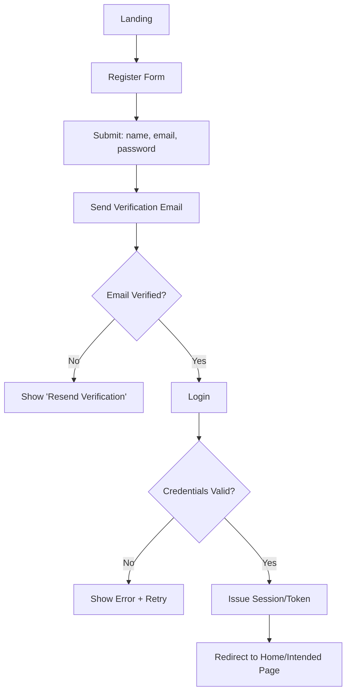
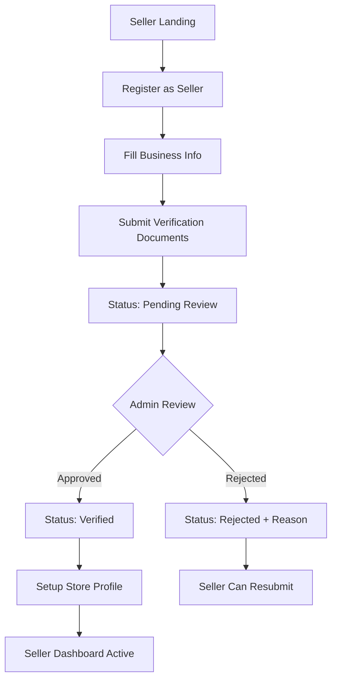
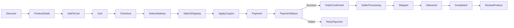
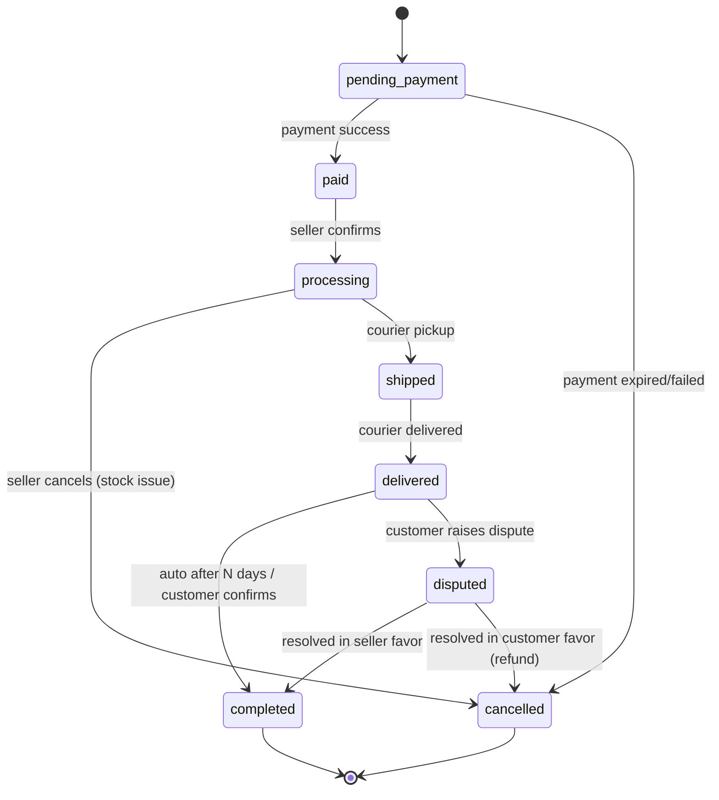
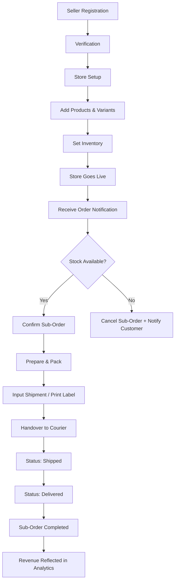
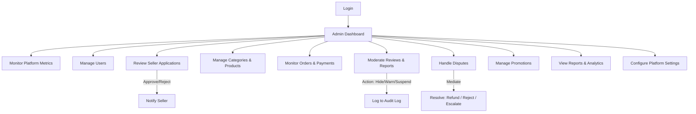
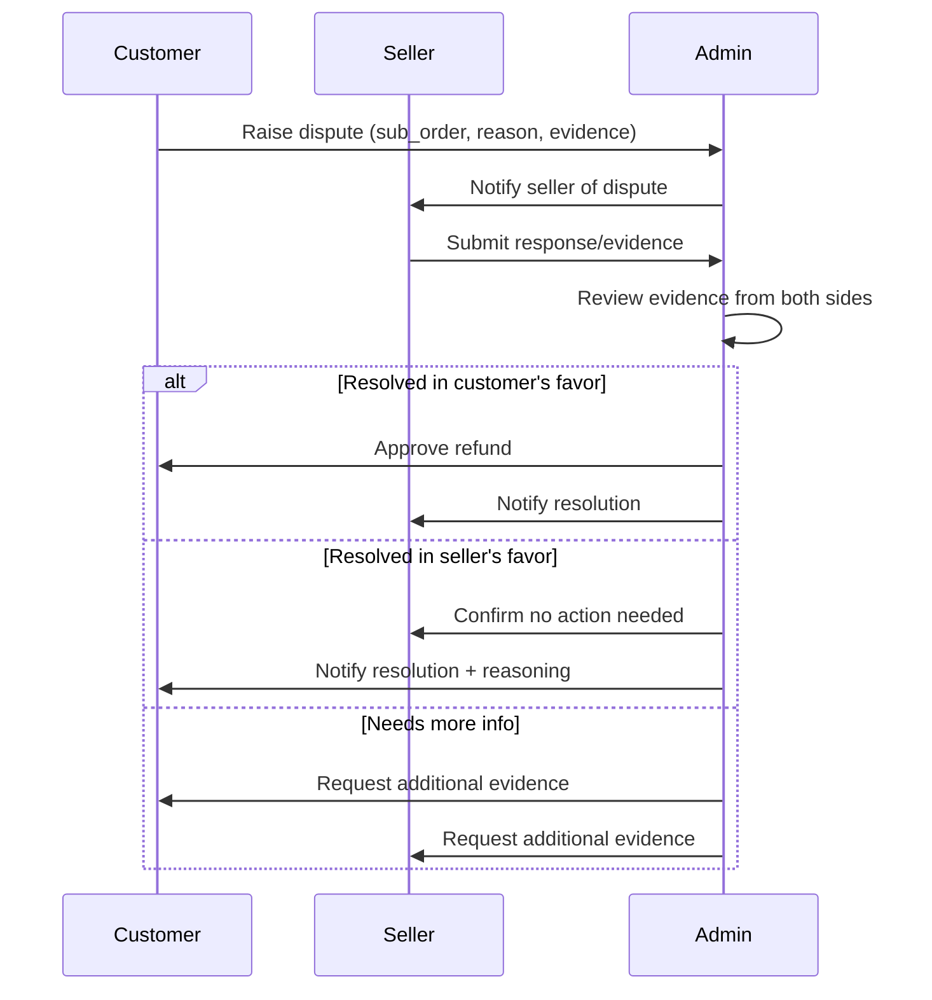

# FLOW.md — User & Business Flow

---

## 1. Authentication Flow

### 1.1 Customer Registration & Login (React)


### 1.2 Seller Registration (Laravel Blade)


### 1.3 Password Reset (Semua Role)
```text
Request Reset (email)
→ Send Reset Link/Token
→ User Opens Link
→ Set New Password
→ Invalidate Old Sessions
→ Redirect to Login
```

**Edge cases:** token expired → minta request baru; email tidak terdaftar → tampilkan pesan generik (hindari user enumeration); token dipakai lebih dari sekali → ditolak.

---

## 2. Customer Flow (End-to-End Purchase)



**Detail penting:**
- Checkout dapat mencakup item dari beberapa seller → sistem otomatis memecah menjadi beberapa `sub_order`, masing-masing dengan ongkir & status sendiri, namun **satu pembayaran** untuk seluruh `order`.
- Jika salah satu sub-order dibatalkan seller (mis. stok habis), order induk **tidak otomatis batal** — hanya sub-order tersebut yang membatalkan & memicu refund parsial.
- **Order Status States:** `pending_payment → paid → processing → shipped → completed` dengan cabang `cancelled` (bisa terjadi sebelum `shipped`) dan `disputed` (setelah `delivered`, sebelum `completed` final).

### 2.1 State Diagram — Order Status


---

## 3. Seller Flow



**Edge cases:** partial stock (sebagian item dalam sub-order out of stock) → seller dapat mem-flag item spesifik untuk dibatalkan tanpa membatalkan seluruh sub-order (jika kebijakan platform mengizinkan; didokumentasikan sebagai opsi di `API.md`).

---

## 4. Admin Flow



---

## 5. Dispute Resolution Flow (Detail)



---

## 6. Notification Triggers (Ringkasan Lintas Flow)

| Event | Penerima |
|---|---|
| Order dibuat & dibayar | Customer, Seller (per sub-order) |
| Sub-order dikonfirmasi/dibatalkan | Customer |
| Status pengiriman berubah | Customer |
| Order selesai | Customer (untuk review), Seller (revenue) |
| Review baru masuk | Seller |
| Seller mengajukan pendaftaran | Admin |
| Seller disetujui/ditolak | Seller |
| Dispute diajukan | Admin, Seller |
| Dispute diselesaikan | Customer, Seller |
| Laporan (report) baru masuk | Admin |
